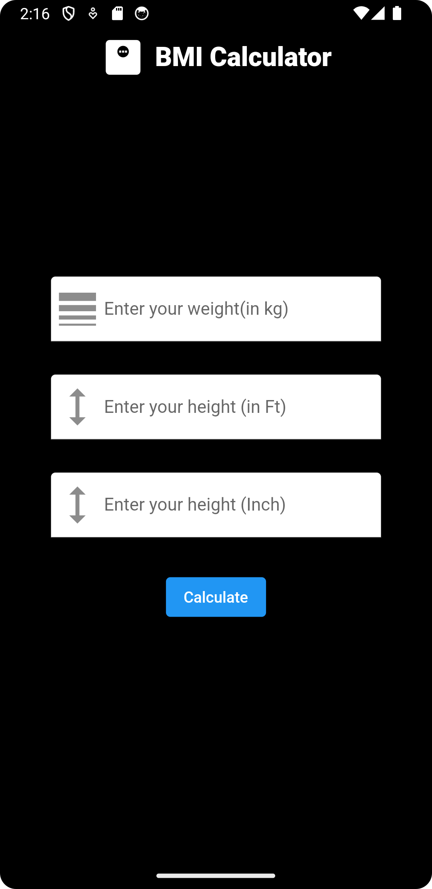

<!-- Title Section -->

  
  <h1 align="center">BMI Calculator</h1>
  
A Flutter-based app to calculate BMI and monitor your health.

<!-- Shields Section -->

  
  
  

## Overview

The BMI (Body Mass Index) Calculator is a Flutter-based app designed to help users monitor their health and fitness journey. This user-friendly app provides a quick and easy way to calculate BMI and gain valuable insights into overall health.

## Features

📊 **Calculate BMI:** Enter height and weight to instantly calculate BMI.

📋 **BMI Interpretation:** Get clear BMI category interpretations.

📌 **Personalized Recommendations:** Receive health recommendations based on BMI.

🚀 **User-Friendly Interface:** Easy navigation for users of all levels.

## Upcoming Features

📏 **Metric and Imperial Units:** Support for height and weight units.

📈 **Share Your Progress:** Share results and progress with others.

📅 **History Tracking:** Record BMI calculations over time.

## Why Use the BMI Calculator App

Maintaining a healthy BMI is essential for overall well-being. Whether you're on a weight loss journey, working to maintain your current weight, or simply curious about your health, the BMI Calculator app is your go-to tool. It provides valuable insights into body composition and offers personalized recommendations to help achieve health and fitness goals.

Stay informed, stay healthy, and take control of your fitness journey with the BMI Calculator app. Download it today and embark on the path to a healthier you!

## Contribution Guidelines

🛠️ We welcome contributions from the developer community to enhance the BMI Calculator app. To contribute:

1. 🍴 Fork this repository.
2. 🌟 Create a new branch for your feature or bug fix: `git checkout -b feature-name`
3. 💡 Make your changes and commit them: `git commit -m 'Description of changes'`
4. 🚀 Push to the branch: `git push origin feature-name`
5. 🔄 Submit a pull request.

We appreciate your contributions and look forward to collaborating with you!

## Getting Started

To get started with the BMI Calculator app:

1. 📥 Clone this repository: `git clone https://github.com/yourusername/BMI-Calculator-App.git`
2. 🚀 Open the project in your preferred Flutter development environment.
3. 📱 Run the app on an emulator or physical device.

## License

This project is licensed under the [MIT License](LICENSE).

---

  Built with ❤️ using Flutter

